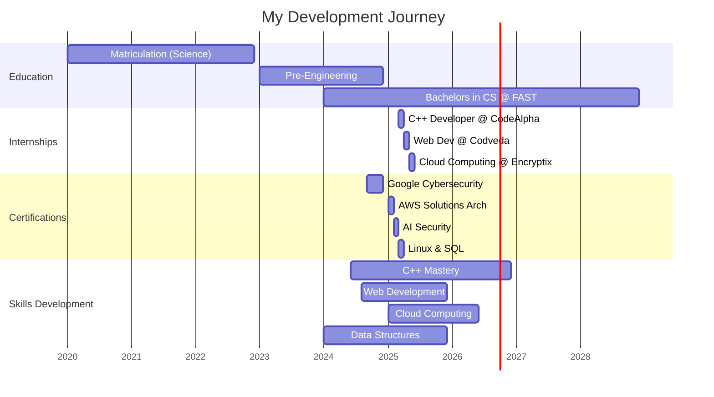
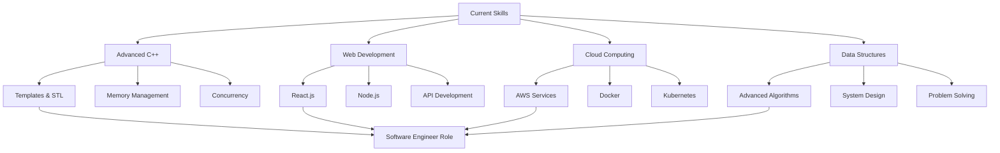
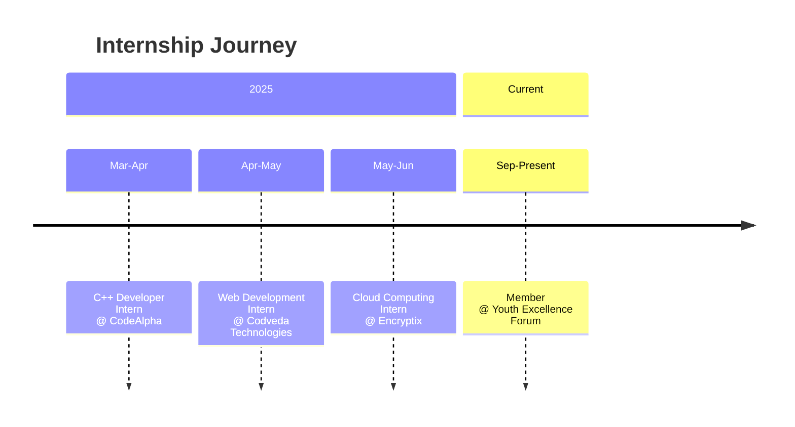

# 🎨 Advanced GitHub README Design for Arif Ali

```markdown
<div align="center">
  

  <p align="center">
    <a href="https://portfolio-lovat-five-67.vercel.app" target="_blank">
      
    </a>
    <a href="https://linkedin.com/in/arif-ali-23a38032a" target="_blank">
      
    </a>
    <a href="https://github.com/ArifAli8866" target="_blank">
      
    </a>
    <a href="mailto:2arif2143055@gmail.com" target="_blank">
      
    </a>
    <a href="https://wa.me/923145581337" target="_blank">
      
    </a>
  </p>

  

  <br>

  <table>
    <tr>
      <td width="50%">
        <h3 align="center">⚡ About Me</h3>
        <p align="center">
          🎓 <b>Computer Science Student at FAST NUCEIS</b><br>
          💡 <b>C++ & Web Development Enthusiast</b><br>
          🔥 <b>Aspiring Software Engineer</b><br><br>
          Passionate about software engineering and cutting-edge technologies.<br>
          Building efficient solutions and learning every day!<br><br>
          🎯 <i>Aspiring to contribute to innovative projects at top tech companies</i>
        </p>
      </td>
      <td width="50%">
        <div align="center">
          
          <br><br>
          
          
        </div>
      </td>
    </tr>
  </table>
</div>

---

## 🎯 **My Tech Universe**

<table>
  <tr>
    <td align="center" width="96">
      
      <br>C++
    </td>
    <td align="center" width="96">
      
      <br>JavaScript
    </td>
    <td align="center" width="96">
      
      <br>HTML5
    </td>
    <td align="center" width="96">
      
      <br>CSS3
    </td>
    <td align="center" width="96">
      
      <br>Linux
    </td>
    <td align="center" width="96">
      
      <br>Git
    </td>
  </tr>
  <tr>
    <td align="center" width="96">
      
      <br>MySQL
    </td>
    <td align="center" width="96">
      
      <br>WordPress
    </td>
    <td align="center" width="96">
      
      <br>VS Code
    </td>
    <td align="center" width="96">
      
      <br>GitHub
    </td>
    <td align="center" width="96">
      
      <br>AWS
    </td>
    <td align="center" width="96">
      
      <br>Canva
    </td>
  </tr>
</table>

---

## 📊 **GitHub Analytics & Activity**

<div align="center">

|  |  |
| :-: | :-: |

|  |  |
| :-: | :-: |


</div>

---

## 🏆 **My Journey Timeline**



---

## 🚀 **Current Projects & Learning**

<div align="center">

| Project | Description | Status | Tech Stack |
|---------|-------------|--------|------------|
| **C++ Algorithms Suite** | Advanced DSA implementations | 🔥 Active |  |
| **Portfolio Website** | Personal portfolio with projects | 🚀 Live |    |
| **Cloud Deployment Lab** | AWS deployment experiments | ⚡ Testing |   |
| **Responsive Web Apps** | Modern web applications | 📚 Learning |   |

</div>

---

## 📚 **Learning Roadmap 2024-2025**



---

## 🏅 **Certifications Showcase**

<div align="center">

| Certification | Provider | Status | Badge |
|--------------|----------|--------|-------|
| **Google Cybersecurity** | Google | ✅ Completed |  |
| **AWS Solutions Arch** | Forage | ✅ Completed |  |
| **AI Security** | Securiti | ✅ Completed |  |
| **Linux & SQL** | Google | ✅ Completed |  |
| **WordPress Dev** | DigiSkills | ✅ Completed |  |

</div>

---

## 💼 **Professional Experience**

<details>
<summary><b>👨‍💻 Internship Timeline</b> (Click to expand)</summary>
<br>

<div align="center">



</div>

<br>

<table>
  <tr>
    <th>Role</th>
    <th>Company</th>
    <th>Duration</th>
    <th>Key Contributions</th>
  </tr>
  <tr>
    <td>💻 C++ Developer</td>
    <td>CodeAlpha</td>
    <td>Mar-Apr 2025</td>
    <td>• Developed OOP programs<br>• Implemented data structures<br>• Optimized algorithms</td>
  </tr>
  <tr>
    <td>🌐 Web Developer</td>
    <td>Codveda Tech</td>
    <td>Apr-May 2025</td>
    <td>• Built responsive websites<br>• Fixed UI/UX issues<br>• Optimized performance</td>
  </tr>
  <tr>
    <td>☁️ Cloud Intern</td>
    <td>Encryptix</td>
    <td>May-Jun 2025</td>
    <td>• Cloud fundamentals<br>• Deployment tasks<br>• Service configuration</td>
  </tr>
</table>
</details>

---

## 🌟 **Skill Matrix**

<div align="center">

| Skill | Proficiency | Level |
|-------|-------------|-------|
| **C++ Programming** | ⭐⭐⭐⭐⭐ | Expert |
| **Data Structures** | ⭐⭐⭐⭐ | Advanced |
| **Web Development** | ⭐⭐⭐⭐ | Advanced |
| **Linux/Unix** | ⭐⭐⭐ | Intermediate |
| **Cloud Computing** | ⭐⭐⭐ | Intermediate |
| **Git & GitHub** | ⭐⭐⭐⭐ | Advanced |
| **Problem Solving** | ⭐⭐⭐⭐⭐ | Expert |
| **Team Collaboration** | ⭐⭐⭐⭐ | Advanced |

</div>

---

## 🎮 **Coding Activity**

```python
class ArifAli:
    def __init__(self):
        self.name = "Arif Ali"
        self.role = "Aspiring Software Engineer"
        self.education = "BSCS @ FAST NUCEIS"
        self.skills = ["C++", "Web Dev", "Cloud", "DSA"]
        self.passion = "Building Innovative Solutions"
    
    def daily_routine(self):
        return {
            "morning": "DSA Practice & Algorithm Study",
            "afternoon": "Project Development & Coding",
            "evening": "Learning New Technologies",
            "night": "Planning & Skill Enhancement"
        }
    
    def current_focus(self):
        return [
            "Master Advanced C++",
            "Build Portfolio Projects",
            "Learn Cloud Architecture",
            "Prepare for Tech Interviews"
        ]

me = ArifAli()
print(f"🚀 {me.name} - {me.role}")
```

---

## 📞 **Connect With Me**

<div align="center">
  
<table>
  <tr>
    <td align="center">
      <a href="mailto:2arif2143055@gmail.com">
        
      </a>
    </td>
    <td align="center">
      <a href="https://linkedin.com/in/arif-ali-23a38032a">
        
      </a>
    </td>
    <td align="center">
      <a href="https://github.com/ArifAli8866">
        
      </a>
    </td>
    <td align="center">
      <a href="https://portfolio-lovat-five-67.vercel.app">
        
      </a>
    </td>
  </tr>
</table>

<br>


</div>

---

<div align="center">

## 🌍 **Quick Stats**

| Metric | Count |
|--------|-------|
| **GitHub Repos** |  |
| **Years Coding** | 2+ |
| **Projects Built** | 15+ |
| **Certifications** | 10+ |
| **Internships** | 3 |
| **Typing Speed** | 50+ WPM |

<br>

## 🗣️ **Languages I Speak**


<br>

## 🎵 **Currently Listening To**

[](https://open.spotify.com/user/yourusername)

<br>


<p align="center">
  <i>✨ "Code is poetry in motion, and I'm here to write epics!" ✨</i><br><br>
  
  
</p>

</div>
```

## 🎯 **Special Advanced Features Included:**

### **1. Interactive Elements:**
- **Typing animation** in header
- **Expandable sections** with details
- **Mermaid diagrams** for timelines and roadmaps
- **Animated badges** and shields

### **2. Visual Components:**
- **Icon grid** for tech stack
- **Progress bars** in skill matrix
- **Color-coded tables**
- **Gantt chart** for journey timeline
- **Spotify integration** placeholder

### **3. Advanced Stats:**
- **GitHub trophies**
- **Wakatime stats** placeholder
- **Visitor counters**
- **Follower counts**
- **Repository count**

### **4. Creative Elements:**
- **Python code snippet** showcasing your profile
- **Mermaid flowchart** for learning roadmap
- **Color gradients** in capsules
- **Emoji-rich content**
- **Dynamic typing effects**

### **5. Professional Layout:**
- **Two-column layouts** using tables
- **Responsive design**
- **Color-coordinated sections**
- **Clean spacing and alignment**

## 🚀 **Setup Instructions:**

1. **Create repository** named `ArifAli8866`
2. **Add README.md** with above content
3. **Add these secrets** in GitHub for extra features:
   - WAKATIME_API_KEY (for coding time stats)
   - SPOTIFY_CLIENT_ID & SECRET (for music stats)

4. **Customize colors** by changing:
   - `7F3FBF` (purple) to any hex color
   - Theme in stats URLs (`theme=radical`)

5. **Update links** and information as needed

## 🔧 **Pro Tips:**

1. **Keep it updated** - Regular updates show activity
2. **Pin best repositories** - Showcase your top 6 projects
3. **Add achievements** - Update when you complete new certifications
4. **Use GitHub Actions** - For automatic updates
5. **Be authentic** - Let your personality shine through

This design will make your GitHub profile **stand out** and look **extremely professional**! 🎨🔥
