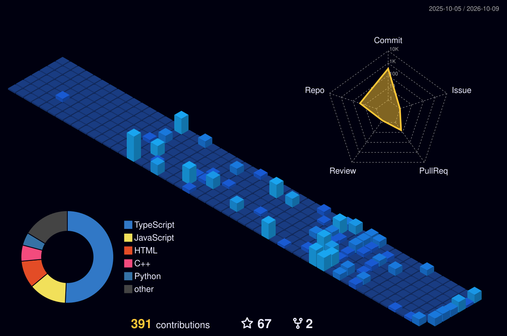

<!-- ═══════════════════════════ HEADER ═══════════════════════════ -->

<!-- 🎬 HERO — boy developer at workstation + animated name + cycling roles -->

  

<!-- 💻 LEFT: systems & web   •   ⚡ RIGHT: life beyond code -->

  

<!-- ⚛️ TECH ARSENAL & ORBIT -->

  

<!-- 🪪 DEVELOPER ID + DASHBOARD -->

  

## ⟡ Apache Open Source

<table width="100%">
<tr>
<td width="33%" valign="top" align="center">

**RocketMQ Rust**

Rust implementation of Apache RocketMQ — memory-safe, high-throughput messaging.

`Active Contributor`

**[→ mxsm/rocketmq-rust](https://github.com/mxsm/rocketmq-rust)**

</td>
<td width="33%" valign="top" align="center">

**Apache RocketMQ**

Distributed messaging and streaming platform used at massive scale.

`Active Contributor`

**[→ apache/rocketmq](https://github.com/apache/rocketmq)**

</td>
<td width="33%" valign="top" align="center">

**Apache EventMesh**

Event-driven application runtime for distributed microservices.

`Active Contributor`

**[→ apache/eventmesh](https://github.com/apache/eventmesh)**

</td>
</tr>
</table>

 

## ⟡ Experience

<table width="100%">
<tr><td>

**C++ Developer Intern** · CodeAlpha · Remote &nbsp; `Mar–Apr 2025`
- Developed OOP-based C++ programs and advanced data structures
- Implemented optimized algorithms for performance-critical systems
- Deepened understanding of memory management and pointer semantics

</td></tr>
<tr><td>

**Web Development Intern** · Codveda Technologies · Remote &nbsp; `Apr–May 2025`
- Built responsive interfaces with HTML5, CSS3, and modern JavaScript
- Improved front-end load times by ~40% through optimization
- Integrated React components with REST APIs

</td></tr>
<tr><td>

**Cloud Computing Intern** · Encryptix · Remote &nbsp; `May–Jun 2025`
- Assisted with AWS deployments (EC2, S3, Lambda, RDS)
- Configured monitoring and alerting with CloudWatch
- Learned Docker containerization and basic Kubernetes orchestration

</td></tr>
</table>

 

## ⟡ 2025–2026 Roadmap

| Goal | Progress | Target |
|---|:---:|:---:|
| Master Rust for systems work | `In progress` | Q2 2025 |
| AWS Solutions Architect certification | `In progress` | Q3 2025 |
| Kubernetes CKA certification | `Starting` | Q3 2025 |
| Apache Committer status | `In progress` | Q4 2025 |
| Land a Software Engineering role | `Actively applying` | 2025 |
| Launch a technical blog | `Planning` | Q2 2025 |

 

## 🌃 My Contribution City

*Every commit builds another tower — rebuilt automatically every day.*

  

## 🐍 Contribution Grid Snake

<picture>
  <source media="(prefers-color-scheme: dark)" srcset="https://raw.githubusercontent.com/ArifAli8866/ArifAli8866/output/github-contribution-grid-snake-dark.svg" />
  <source media="(prefers-color-scheme: light)" srcset="https://raw.githubusercontent.com/ArifAli8866/ArifAli8866/output/github-contribution-grid-snake.svg" />
  
</picture>

  

<!-- 💌 LET'S CONNECT -->

  

  

**Converts coffee into commits, one PR at a time.** ☕⚡

